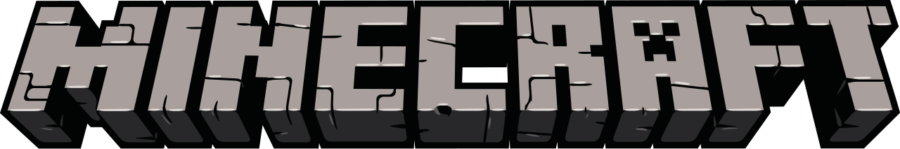

<!-- PROJECT LOGO -->
<br />
<p align="center">
  <a href="https://github.com/KinderrKill/MinecraftLauncher">
    
  </a>

  <h3 align="center">Launcher / Installeur Minecraft</h3>

  <p align="center">
    Launcher/Installeur Minecraft, utilisable sans modifier une seul ligne de code !<br/>
    Le code source est disponible librement pour vous permettre de modifier et personnaliser cet installeur.<br/><br/>
    Le principal avantage de cet installeur c'est qu'il ne prend pas en compte les identifiants des joueurs, <br/>
    il télécharge et met à jour si besoin votre client et lance avec un profil automatiquement crée, le véritable Launcher Minecraft <br/>
    (Conforme donc à L'EULA et au souhait des développeurs).<br/><br/>
    De plus avec l'arrivé de l'authentification Microsoft, nous ne sommes pas à l'abris d'une <br/>
    coupure bête et simple des systèmes d'authentification externes.<br/>
    <br />
    <a href="https://youtu.be/a9RvZ2-TvhI">Vidéo de présentation</a>
    ·
    <a href="https://github.com/KinderrKill/MinecraftLauncher/issues">Signaler un bug</a>
    ·
    <a href="https://github.com/KinderrKill/MinecraftLauncher/issues">Demander un ajout</a>
  </p>
</p>


<!-- TABLE OF CONTENTS -->
<details open="open">
  <summary><h2 style="display: inline-block">Sommaire :</h2></summary>
  <ol>
    <li>
      Téléchargement de l'installeur</a>
      <ul>
        <li>Modification du fichier Launcher.properties</a></li>
        <li>Exemple de configuration</a></li>
        <li>Distribuer votre installeur</a></li>
        <li>Mettre à jour votre client</a></li>
      </ul>
    </li>
    <li>
      Récupérer les sources de l'installeur</a>
      <ul>
        <li>Prérequis</a></li>
        <li>Installation</a></li>
        <li>Explications des classes</a></li>
        <li>Exporter votre installeur</a></li>
        <li>Convertir en .exe</a></li>
        <li>Possibilités</a></li>
      </ul>
    </li>
    <li>Contribuer</a></li>
    <li>Contacts</a></li>
    <li>Remerciement</a></li>
  </ol>
</details>


<!-- HREF: about-the-project -->
## I - Téléchargement de l'installeur
<p align="center">

</p>

1. Télécharger la dernière [version](https://github.com/KinderrKill/MinecraftLauncher/releases) disponible à cette adresse. 

2. Ouvrez le fichier **.jar** à l'aide d'un logiciel externe (Exemple [Winrar](https://www.win-rar.com/start.html?&L=10)).

3. Ouvrez et éditer le fichier `Launcher.properties`
<br/><br/>

<!-- HREF: built-with -->
### Modification du fichier Launcher.properties

Le fichier `Launcher.properties` regroupe toutes les modifications et options disponible sans modifier une seul ligne de code !
<br/><br/>
* **Modifications obligatoire pour le bon fonctionnement de votre installeur**

 1. Lien du dossier contenant vos fichiers *.json / .jar / version.txt et optionnellement .zip
    ```
    DOWNLOAD_URL=https://exemple/launcher/files/`
    ```
    **NOTE :** Il est important de pouvoir avoir accès à votre en fichier en téléchargement directement  
    Exemple : `https://exemple/launcher/files/minecraft.jar` doit télécharger directement le fichier .jar
<br/><br/>
 2. Nom de votre fichier .jar et fichier .json
    ```
    CLIENT_FILE_NAME=CLIENT
    ```
    **NOTE :** Il est important de ne pas mettre d'espace ni d'accent sur ce nom !
<br/><br/>
 3. Nom de votre fichier .txt qui contiendra le numéro de version de votre jeu
    ```
    CLIENT_VERSION_NAME=CLIENT_Version
    ```
    **NOTE :** Il est important de ne pas mettre d'espace ni d'accent sur ce nom !
<br/><br/>

Exemple du dossier contenant les fichiers .json / .jar / version.txt et optionnellement .zip
<p align="center">

</p>
Vous pouvez aussi retrouver un exemple ici : https://github.com/KinderrKill/MinecraftLauncher/tree/master/src/web-files-exemple
<br/>


**Le reste des modifications sont optionnelles**

Voici un exemple de configuration possible avec des commentaires spécifiés par un # en debut de phrase

```
#Icône du profil sur le launcher Minecraft. Pour avoir ce code, allez sur le site https://www.base64-image.de/, mettez en ligne une image et cliquer sur "copy image", ensuite, vous pouvez faire un CTRL + V.
MINECRAFT_PROFIL_ICON=data:image/png;base64,iVBORw0KGgoAAAANSUhEUgAAACAAAAAgCAYAAABzenr0AAAACXBIWXMAAAsTAAALEwEAmpwYAAAKT2lDQ1BQaG90b3Nob3AgSUNDIHByb2ZpbGUAAHjanVNnVFPpFj333vRCS4iAlEtvUhUIIFJCi4AUkSYqIQkQSoghodkVUcERRUUEG8igiAOOjoCMFVEsDIoK2AfkIaKOg6OIisr74Xuja9a89+bN/rXXPues852zzwfACAyWSDNRNYAMqUIeEeCDx8TG4eQuQIEKJHAAEAizZCFz/SMBAPh+PDwrIsAHvgABeNMLCADATZvAMByH/w/qQplcAYCEAcB0kThLCIAUAEB6jkKmAEBGAYCdmCZTAKAEAGDLY2LjAFAtAGAnf+bTAICd+Jl7AQBblCEVAaCRACATZYhEAGg7AKzPVopFAFgwABRmS8Q5ANgtADBJV2ZIALC3AMDOEAuyAAgMADBRiIUpAAR7AGDIIyN4AISZABRG8lc88SuuEOcqAAB4mbI8uSQ5RYFbCC1xB1dXLh4ozkkXKxQ2YQJhmkAuwnmZGTKBNA/g88wAAKCRFRHgg/P9eM4Ors7ONo62Dl8t6r8G/yJiYuP+5c+rcEAAAOF0ftH+LC+zGoA7BoBt/qIl7gRoXgugdfeLZrIPQLUAoOnaV/Nw+H48PEWhkLnZ2eXk5NhKxEJbYcpXff5nwl/AV/1s+X48/Pf14L7iJIEyXYFHBPjgwsz0TKUcz5IJhGLc5o9H/LcL//wd0yLESWK5WCoU41EScY5EmozzMqUiiUKSKcUl0v9k4t8s+wM+3zUAsGo+AXuRLahdYwP2SycQWHTA4vcAAPK7b8HUKAgDgGiD4c93/+8//UegJQCAZkmScQAAXkQkLlTKsz/HCAAARKCBKrBBG/TBGCzABhzBBdzBC/xgNoRCJMTCQhBCCmSAHHJgKayCQiiGzbAdKmAv1EAdNMBRaIaTcA4uwlW4Dj1wD/phCJ7BKLyBCQRByAgTYSHaiAFiilgjjggXmYX4IcFIBBKLJCDJiBRRIkuRNUgxUopUIFVIHfI9cgI5h1xGupE7yAAygvyGvEcxlIGyUT3UDLVDuag3GoRGogvQZHQxmo8WoJvQcrQaPYw2oefQq2gP2o8+Q8cwwOgYBzPEbDAuxsNCsTgsCZNjy7EirAyrxhqwVqwDu4n1Y8+xdwQSgUXACTYEd0IgYR5BSFhMWE7YSKggHCQ0EdoJNwkDhFHCJyKTqEu0JroR+cQYYjIxh1hILCPWEo8TLxB7iEPENyQSiUMyJ7mQAkmxpFTSEtJG0m5SI+ksqZs0SBojk8naZGuyBzmULCAryIXkneTD5DPkG+Qh8lsKnWJAcaT4U+IoUspqShnlEOU05QZlmDJBVaOaUt2ooVQRNY9aQq2htlKvUYeoEzR1mjnNgxZJS6WtopXTGmgXaPdpr+h0uhHdlR5Ol9BX0svpR+iX6AP0dwwNhhWDx4hnKBmbGAcYZxl3GK+YTKYZ04sZx1QwNzHrmOeZD5lvVVgqtip8FZHKCpVKlSaVGyovVKmqpqreqgtV81XLVI+pXlN9rkZVM1PjqQnUlqtVqp1Q61MbU2epO6iHqmeob1Q/pH5Z/YkGWcNMw09DpFGgsV/jvMYgC2MZs3gsIWsNq4Z1gTXEJrHN2Xx2KruY/R27iz2qqaE5QzNKM1ezUvOUZj8H45hx+Jx0TgnnKKeX836K3hTvKeIpG6Y0TLkxZVxrqpaXllirSKtRq0frvTau7aedpr1Fu1n7gQ5Bx0onXCdHZ4/OBZ3nU9lT3acKpxZNPTr1ri6qa6UbobtEd79up+6Ynr5egJ5Mb6feeb3n+hx9L/1U/W36p/VHDFgGswwkBtsMzhg8xTVxbzwdL8fb8VFDXcNAQ6VhlWGX4YSRudE8o9VGjUYPjGnGXOMk423GbcajJgYmISZLTepN7ppSTbmmKaY7TDtMx83MzaLN1pk1mz0x1zLnm+eb15vft2BaeFostqi2uGVJsuRaplnutrxuhVo5WaVYVVpds0atna0l1rutu6cRp7lOk06rntZnw7Dxtsm2qbcZsOXYBtuutm22fWFnYhdnt8Wuw+6TvZN9un2N/T0HDYfZDqsdWh1+c7RyFDpWOt6azpzuP33F9JbpL2dYzxDP2DPjthPLKcRpnVOb00dnF2e5c4PziIuJS4LLLpc+Lpsbxt3IveRKdPVxXeF60vWdm7Obwu2o26/uNu5p7ofcn8w0nymeWTNz0MPIQ+BR5dE/C5+VMGvfrH5PQ0+BZ7XnIy9jL5FXrdewt6V3qvdh7xc+9j5yn+M+4zw33jLeWV/MN8C3yLfLT8Nvnl+F30N/I/9k/3r/0QCngCUBZwOJgUGBWwL7+Hp8Ib+OPzrbZfay2e1BjKC5QRVBj4KtguXBrSFoyOyQrSH355jOkc5pDoVQfujW0Adh5mGLw34MJ4WHhVeGP45wiFga0TGXNXfR3ENz30T6RJZE3ptnMU85ry1KNSo+qi5qPNo3ujS6P8YuZlnM1VidWElsSxw5LiquNm5svt/87fOH4p3iC+N7F5gvyF1weaHOwvSFpxapLhIsOpZATIhOOJTwQRAqqBaMJfITdyWOCnnCHcJnIi/RNtGI2ENcKh5O8kgqTXqS7JG8NXkkxTOlLOW5hCepkLxMDUzdmzqeFpp2IG0yPTq9MYOSkZBxQqohTZO2Z+pn5mZ2y6xlhbL+xW6Lty8elQfJa7OQrAVZLQq2QqboVFoo1yoHsmdlV2a/zYnKOZarnivN7cyzytuQN5zvn//tEsIS4ZK2pYZLVy0dWOa9rGo5sjxxedsK4xUFK4ZWBqw8uIq2Km3VT6vtV5eufr0mek1rgV7ByoLBtQFr6wtVCuWFfevc1+1dT1gvWd+1YfqGnRs+FYmKrhTbF5cVf9go3HjlG4dvyr+Z3JS0qavEuWTPZtJm6ebeLZ5bDpaql+aXDm4N2dq0Dd9WtO319kXbL5fNKNu7g7ZDuaO/PLi8ZafJzs07P1SkVPRU+lQ27tLdtWHX+G7R7ht7vPY07NXbW7z3/T7JvttVAVVN1WbVZftJ+7P3P66Jqun4lvttXa1ObXHtxwPSA/0HIw6217nU1R3SPVRSj9Yr60cOxx++/p3vdy0NNg1VjZzG4iNwRHnk6fcJ3/ceDTradox7rOEH0x92HWcdL2pCmvKaRptTmvtbYlu6T8w+0dbq3nr8R9sfD5w0PFl5SvNUyWna6YLTk2fyz4ydlZ19fi753GDborZ752PO32oPb++6EHTh0kX/i+c7vDvOXPK4dPKy2+UTV7hXmq86X23qdOo8/pPTT8e7nLuarrlca7nuer21e2b36RueN87d9L158Rb/1tWeOT3dvfN6b/fF9/XfFt1+cif9zsu72Xcn7q28T7xf9EDtQdlD3YfVP1v+3Njv3H9qwHeg89HcR/cGhYPP/pH1jw9DBY+Zj8uGDYbrnjg+OTniP3L96fynQ89kzyaeF/6i/suuFxYvfvjV69fO0ZjRoZfyl5O/bXyl/erA6xmv28bCxh6+yXgzMV70VvvtwXfcdx3vo98PT+R8IH8o/2j5sfVT0Kf7kxmTk/8EA5jz/GMzLdsAAAAgY0hSTQAAeiUAAICDAAD5/wAAgOkAAHUwAADqYAAAOpgAABdvkl/FRgAACh1JREFUeNqUl1ls3Nd5xX/3v82+D4eLuIoiJUqyLJm2pdpuXNSRm2ZxnKCJC2R5bN+SxgWKomgfW7QFkrZ5KJoGKIoUWboAFuIiKiLHsBzFjmxRiylRpMR1yKFmSM6+/ffbh6EV22hj+T7+l3sPzvnOud8npJT89lOPYbvg+RIAVRHomkAgcX1w3N5zRQh0DRxPCkMVv6upyp8hEK4r/8r2/J8ENCEBXA8cr/ePrgk0BWwXNFWgCBACPN/ntV9cQeOjLQPE7+uq+OPHHxo+8YWzM0jf579+tvjfl+cL88A3Qf4QsB90Q/GADMSFEH+QjBhf/8zJ4eGDfREatoPl+vieTzigEgsY5Msdzt/YKuw2rX9wPfkdoPFhDHwYgCFfiq/1xUJ/+NnZkeQzRwdQFMlWucWtzRrSdnBtByVgcGwsxWg2jkTh1YUi5+Y264Vq5zuayrc1hcJHAqAo4nhAE9+YGoh/6fnZ0cCJgRiO67DdcljablBvW+QSIZ6Y6sPtdPnlyh57liQa0pgeiHF4OIMi4a3VMi9f37TvFBs/sFz5LV0V878egJQfE4g/iYf1T/7R2SPi0Yk0Hcvm8o08K5UOqVSMTz4yhqErvL1c4vpqGdf1mEqH+M0TIwhd58dv3qHZsXl0ZoiZ4RQBTWNuvcK3LyxK03bPSyn/VggufhDAZz1f/OmTp0bPPPf0FD9+dYHfmkjje5LlQpXRsMp4X4ylusVWpU02EcZ2fB6dzCGAy4vbGIZKpW0RF5JTwymqaCwW6xzsj6EbKq+tVXn+48f5yetLvH5147Lren/92htXzikAc+8snBvv186U9pps7TTxpSQc0EjHAgQDOjXbp2sEaXQdUtEAqUiATteiVGlSbpn4ikI2GSYVCdA0Xaodm3LLJKirpKIBQrqK7/tsFmsUdhr0RfzTV27cegno2dA0LWanItTaJv9z8Rp7dckT/XFOHxlkPBulUGlzM1/Fk4LHD/YTEJJ7hTJzK7sEgjrDmQjHR9K0MjEuOZItW3JiLMFgMownBa/dLnJzeYe1jQJDcUkqBZZlcR+AADLRGKps4aZdDNnm3396mflbQzw8NcDDhwf4nZPD7NY73C7UWC42OBAJ8OXZQULxCK/OF/jhpWUO9sd58mg/uUSEtuny0lyBn17fYGWjwJHREP2pENKXSOVX8aMBSMByPDqOg215zIzmuNkqUK+V+NH5NS7PD3FyZoRThwd4emaA2ckst7ZqnL9dQiAYTId54alJooZOuWXzvZ+v8srcCqWVTUbiCglDIRmJUm50ScdCKL5EyvcEka6p8oWz06TiQWJBDdWHmuly4We3GA/rnJwZodj1icTTJHMZxrJR9JBGKKjjux6242GZHvm9Nr9YzGOVy+Q8i8W1MjtC8OSZUaYPxLm9UUVVoGV6/Hy+iOf5Qtn3PYcPZrAcj9ev5bm7XWXsQJKP/cYUFcfl5Wtr3LPaHBgN0pdVuLRc5I2VKumhDP1jOS6v13jp7SXWiqvEtDodt8uljQo14PSpAxxIR1hY3aPW6KAKOD6eRBHvkaB3aahk40EeHstAyOBOvsrqbpOVls2zZ6Y5Nj1AXyqEJ13OnkrT7Pq8+DfnQPqcmgwxEPFodxymBuIkQgaapnB1ucxWpc3djQqJuMGpIzkiIR3T8dhXAOVdAMlwhM1Si3dWypyYHOSpExOkYhFqXSi3bAKajqHpFCtNul2TRFhlZS3P6sYW2ahOUFOwHY+1fA1PSrqOB0DAUDk2lmIsF0Mqgo7jETQMxPuKUEqqDZPjBwdZvLtDUNNA+qRjQVJhMHTJxat3uVdqksvE+MzTxxCit4UQoCkKXden3uiyW+4wMpImaPTIjYU0stEA4aiBEQ6gCEGx2rlfhPs2FNSaXRbXdrAdDw+FgKqCBCkhHQsymAixtlZmoVJicXmHr37uMSS99xvFOiubFVoNixNHB5gYSvH2YmkfoGCpWCObiqLUupSqLXLp2H0b9iQQcHSin9PHxrBceHVuhRt3t2l1LXwJilDIRYOENIUjh/pBwOL6DtKXuJ5PtdllfCjB5FAST8KFK5uYVk+CpungK4Krt4uYlsujR4aYPJBEfLAIy6ZD+vAznK6lOTozweLceZa3q7QsqHUs3tmucvDoCd586xpm18L1fCSgqoKh/jjLm3XyxRaHhKBYbhMKqAC0Oi4PjSeZPZwjHAzQtBzaHfsDDABhfLbWl/j0c8+hKBqpeJjJAzHCBuxWu3Rtn099/ov8079+n09//gv4vBthvRUJGrRMB08Jk4lpOG6PgZFsmIFMhPxeh1rDQkUSD+jvT0Lf93nzZh7YpF4pMjo9S0DViBoGQR1mRlJMDGfIJEKkUmk+/olPcenlAoJVFCHIxSO0mjaPHJ/i5CNnWLnzDm9dmweg43h0HY+BZJBuuUNZkezUO/jv9h69DkjhsZlR+tNRKuVtrl65RMu0qJkOpgNNyyGZCPLKue9SyC8DsLa9hy8lnieZWyrScQTj4xNsri6QzQ2jKz0JpARNCOpth4sLRdaLDY6M9aHsJ9H9u0AqHuO5BGnNZ357h4VCE8tVsF3wpcRyXTzpEQoGcE3JYDaB2O9uZsazxJN9NNQkm1vrJOIREvEA7Lapt2xu52tEwxqPH+qjJSRCE++XoGcXhYWNIjO5KM+cnqbS7HDxyiamC5WGjXTh2Ggf0VCAjuPwbpIoQuDjs9doEAjrzPQrtFpbWJbba6N1hdHBKJqqIB2fhKFgaMoHbkMp6XRdBvoi7DVMDuY0BpIJ+pIVghpoCixtlgkHdLrXrpIdnkbuF6AEBJKoMKnvrbFZamDaLobWkyAe1kmHDWzPRw8YBHWNnWr7fhAp+zp98fZ66erGvSaVrkOl3UJRBLoCYQOyySCHRlNEIjr/9i//yPraCt3ur6zUaFrcXK+SLzXJpiIcn+onmwz1olhTcWWPqc3tGpdubHBrbeealPKF99rwP6WUs54vz3ZceWHuVoG7+V0c10MIiBg62UiETCLE7z0xyWMPzdDsmPi+xHU9dqodRjJRpjNRhvviRAPGfXCeD6VKl+t3dri+eO+Vruk+ixSzwH+8Lwf26XxFSp61bPeRlUL5+8vbVadtg0TF9n00RUHLRLlz+5dMDGVRFQVdV3noUD+24+1Ht0RVxH2KN0pNt1Rp/8D15KyUnJVw4b0Bovw/E9M1KeWXpeSQ6fB3N9d3W0v5PVzHpz+RpLQ6x15lF0mvs9mpt6m1Te7VOpRqLZY2ymzvtlrA34M8BHwJuPp/HaR8yOiWB170JaPVpvnnc4v3Shcu3yUVDfOJMzOoqoIA+hJhgkGNuuWytFYu7VTbf+FLOQZ8A9j4dQc86HBaRfKXvpTfLO01vtKx7Bcz8cgR6Us8AbfWypiWuyTgW1LyPSkxH3Q4VT7idGwC35WSY41293nPl2/4vnyzbTqfk1IelfDP+9888PrfAQA7qTFoxhoxmgAAAABJRU5ErkJggg==

#Lien du dossier contenant les fichiers .json / .jar / version.txt et .zip
DOWNLOAD_URL=https://exemple/launcher/files/

#Nom présent sur la fenêtre du launcher
CLIENT_TITLE=PVP Faction Yolycube

#Nom des fichiers .jar, .json et du fichier contenant la version du jeu.
CLIENT_FILE_NAME=Yolycube
CLIENT_VERSION_NAME=Yolycube_Version

#Laisser à "null" si vous n'avez pas de ressource pack à faire télécharger, sinon renseignez juste le nom du ressource pack présent dans le même dossier que le fichier .json et .jar (LE FICHIER DOIT ETRE EN .zip)
RESOURCE_PACK_NAME=RessourcePack_YolyCube.zip


#_________________________
#MODIFICATIONS ESTHETIQUES
#_________________________

#Fenêtre principal|| Taille : par default WINDOW_WIDTH = 960 | WINDOW_HEIGHT = 540
WINDOW_WIDTH=960
WINDOW_HEIGHT=540

#Textures (Présentes dans le dossier src>main>resources>assets)
LAUNCHER_ICON_TEXTURE=launcher_icon.png
BACKGROUND_TEXTURE=background.jpg

#Logo principal || Taille et position en pourcentage 50%W% = milieu de la fenêtre de droite à gauche, 50%H% = milieu de la fenêtre de haut en bas.
MAIN_LOGO_TEXTURE=main_logo.png
MAIN_LOGO_WIDTH=40%w%
MAIN_LOGO_HEIGHT=15%h%
MAIN_LOGO_POS_X=50%w%
MAIN_LOGO_POS_Y=5%h%

#Bouton jouer || Alignement possibles : LEFT, CENTER, RIGHT
#Textures 0 = Normal | 1 = Survolé | 2 = Activé (Téléchargement et vérification des fichiers)
PLAY_BUTTON_0_TEXTURE=play_button_0.png
PLAY_BUTTON_1_TEXTURE=play_button_1.png
PLAY_BUTTON_2_TEXTURE=play_button_2.png
PLAY_BUTTON_WIDTH=20%w%
PLAY_BUTTON_HEIGHT=10%h%
PLAY_BUTTON_POS_X=50%w%
PLAY_BUTTON_POS_Y=65%h%
PLAY_BUTTON_ALIGN=CENTER

#Chemin de votre launcher Minecraft
MINECRAFT_PATH_POS_Y=80%h%

#Bar de chargement || Taille : par défaut BAR_HEIGHT=20 | BAR_POS_Y=430
BAR_WIDTH=100%w%
BAR_HEIGHT=20
BAR_POS_Y=480
BAR_POS_X=50%w%
BAR_ALIGN=CENTER
#Couleur de la barre et du texte en HEX
#COLOR_PRIMARY = Couleur de base de la barre | COLOR_SECONDARY = Couleur de remplissage de la barre
BAR_COLOR_PRIMARY=#9C9C9C
BAR_COLOR_SECONDARY=#D4D4D4
BAR_COLOR_TEXT=#FFFFFF
```

**Distribuer votre installeur**

Une fois les modifications effectuées sur votre fichier `Launcher.properties` vous devez faire un test sur votre ordinateur  
pour vous assurer que tout fonctionne correctement et que tout est jouable. 

Une fois cela fait vous pouvez simplement via un hébergeur classique ou directement via Discord faire télécharger votre installeur.
<br/><br/>
**Mettre à jour votre jeu**


Si vous faites une mise à jour de votre client, votre fichier .json ou votre fichier .zip, vous allez devoir modifier la valeur présente dans le fichier 
`CLIENT_Version.txt` par défaut à 1. Si vous le passez à 2, cela va mettre à jour lors du prochain lancement de l'installeur le jeu.

Vous devez répéter cette opération à chaque mise à jour.

**NOTE :** Vous devez uniquement mettre des nombres entiers ! (1 / 10 / 1999 et non 1.1 voir 2,5).
<br/><br/>

<!-- GETTING STARTED -->
## II - Récupérer les sources de l'installeur

Pour récupérer le code source de l'installeur rien de plus simple, vous devez suivre les étapes suivantes.

### Prérequis

* Posseder un IDE (Eclipse / Intellij etc...)
* Posseder GIT

### Installation

1. Cloner le repo
   ```
   git clone https://github.com/KinderrKill/MinecraftLauncher.git
   ```
2. Lancer la class `fr.kinderrkill.launcher.Main`

3. Modifier votre installeur à votre guise :)

### Explications des classes

Brièvement, voici comment a été codé l'installeur :

Package `fr.kinderrkill.launcher` :
1. `LauncherPanel` = Contient tout l'affichage et l'enregistrement des élements graphiques.
2. `LauncherWindow` = Initialization de la création de la fenêtre (Taille/Dimension).
3. `Main` = Classe principal de lancement de l'installeur

Package "fr.kinderrkill.launcher.utils" :
1. `Config` = Sert de liaison entre le fichier .properties et le code.
2. `Installer` = Contient les fonctions de téléchargement et lancement de l'installeur.
3. `MinecraftLauncherFilter` = Outil de filtre pour la recherche manuelle du launcher Minecraft.
4. `MinecraftLauncherFinder` = Outil de recherche de launcher Minecraft
5. `OSHelper` = Outil de détéction des systèmes d'exploitation et fonctions de navigation vers le répertoire .minecraft
6. `Utils` = Contient des fonctions pour les versions du jeu, nom de variables et autre modification du .properties.
    
### Exporter votre installeur :

Avec Gradle rien de plus simple :
`Gradle > Task > Build > jar`

<p align="center">

</p>

Et l'installeur sera mis dans le dossier `build > libs`

### Convertir en .exe :

Pour convertir votre fichier .jar en .exe (et ainsi avoir une belle icône), vous devrez utiliser le logiciel [Launch4J](http://launch4j.sourceforge.net/)
Il existe beaucoup de tutoriel sur son utilisation sur internet :)

<!-- Possibilitées -->
## Possibilitées

Je n'ai pas la prétention d'être un bon développeur voir un développeur tout court, je m'en sort depuis des années en suivant beaucoup de vidéos et tutos sur internet.  
Je me suis donc permis de vous fournir une base qui n'est sûrement pas la plus optimisé ni la plus propre en code, mais au moins c'est fonctionnel.

Ce code est surtout très maléable, vous pouvez en faire ce que vous voulez !  

A titre d'exemple l'installeur de mon projet [CompanyofCube](https://companyofcube.fr/) à été crée à partir de cette base.

<!-- CONTRIBUTING -->
## Contribuer


Les contributions sont ce qui fait de la communauté open source un endroit incroyable pour apprendre, inspirer et créer. Toute contribution que vous faites est ** grandement appréciée **.

1. Fork le project
2. Créer votre une branche (`git checkout -b feature/AmazingFeature`)
3. Commit vos modifications (`git commit -m 'Add some AmazingFeature'`)
4. Push sur votre branche (`git push origin feature/AmazingFeature`)
5. Ouvrez une Pull Request


<!-- CONTACT -->
## Contact

* [Twitter](https://twitter.com/KinderrKill)
* [Youtube](https://www.youtube.com/channel/UCzzeZfPXqh18DFtI2ml0DVg)
* [Twitch](https://www.twitch.tv/kinderrkill)


Project Link: [https://github.com/KinderrKill/MinecraftLauncher](https://github.com/KinderrKill/MinecraftLauncher)


<!-- ACKNOWLEDGEMENTS -->
## Remerciement

* [Zeldown](https://github.com/Zeldown/) [[Zeldown Github]](https://github.com/Zeldown/) Pour son intéret pour le projet et son aide pour la mise en place d'une meilleur configuration dynamique !
